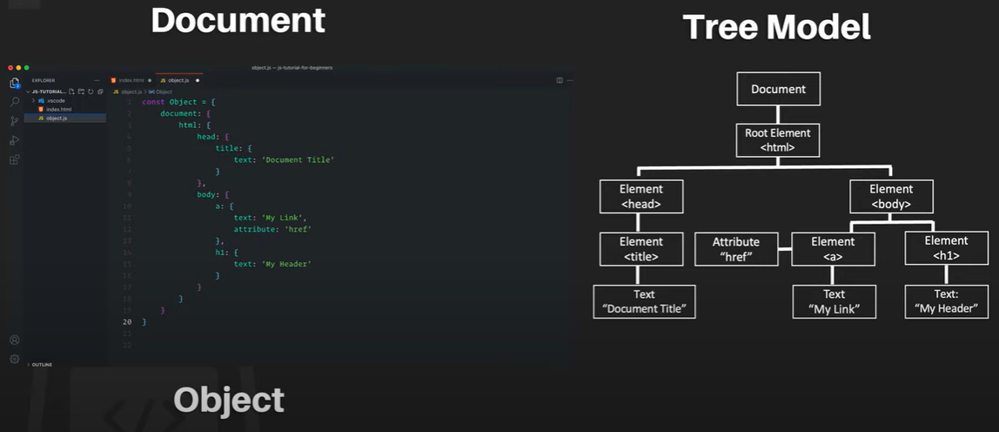

# DOM (Document Object Model)

JavaScript can manipulate the HTML tags dynamically using DOM.  
Below features are being used to manipulate the html tags.  
**POEM**
- Properties
- Object
- Events
- Methods

Just think the html file as a document which is considered or represent as object in JavaScript and that object can be represented as a tree model. That scenario is called DOM.



**Document:**
```html
<!DOCTYPE html>
<html lang="en">
<head>
    <title>Document</title>
</head>
<body>
    <h1>My Head</h1>
    <a href="myLink"></a>
</body>
</html>
```
**Methods:**

**`document.getElementById()`**
This is a method of document by which we can call a tag of html using id.

**`document.getElementsByTagName(tagName):`** Finding elements by using Tag names.

**`document.getElementsByClassName(className):`** Finding elements using class names.

**`innerHTML`**  
innerHTML is a property of document object. Using this property we can assign value to specified id.

**Example:**  
index.html
```html
<!DOCTYPE html>
<html lang="en">
<head>
    <meta charset="UTF-8">
    <meta name="viewport" content="width=device-width, initial-scale=1.0">
    <title>Document</title>
</head>
<body>
    <p id="demo">Hello</p>           <!--id-->
    <p class="classDemo">Class Test</p>   <!--class-->
    <p>Test01</p>
    <script src="scripts.js"></script>
</body>
</html>
```
scripts.js
```js
const demoId=document.getElementById("demo");    //Fetching the p tag using id demo
demoId.innerHTML="ID Test";                      //Assigning the value to that 

const demoClass= document.getElementsByClassName("classDemo");
console.log(demoClass);             //HTMLCollection [p.classDemo]

const tagDemo= document.getElementsByTagName("p");
console.log(tagDemo);               //HTMLCollection(3) [p#demo, p.classDemo, p, demo: p#demo]
```